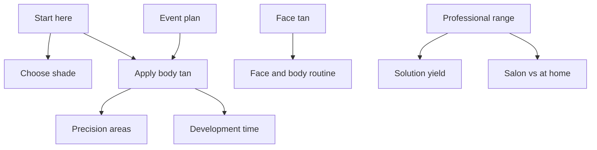

# Jimmy Coco Editorial Content Strategy — 12 Weeks

## Outcome

Build the most useful expert-led tanning library in the category while moving readers naturally from uncertainty to the correct Jimmy Coco product or professional solution.

The programme must create four commercial effects:

1. acquire non-brand search demand around tanning questions;
2. reduce uncertainty before product-page visits;
3. increase attachment of application tools and face/body routines;
4. establish Jimmy Coco as a working professional authority, not merely a celebrity-associated founder.

## Audience priorities

| Audience | Main anxiety | Content response | Primary commercial route |
|---|---|---|---|
| First-time at-home tanner | Streaks, orange colour, wrong shade | Start-to-finish application and medium/dark guidance | Malibu Soufflé + Buff & Glow Mitt |
| Experienced self-tanner | Wants a more believable, controlled finish | Professional layering, precision areas and face/body balance | Malibu Soufflé, Body Brush, Face Brush |
| Face-tan customer | Patchiness, skincare compatibility, over-dark result | Dedicated mist routine and gradual build guidance | A-List Face Tanning Mist |
| Event-led customer | Timing, transfer, photographs and corrections | 72-hour plan with trial and rinse timing | Appropriate Malibu shade + application tools |
| Salon professional | Solution selection, yield, consistency and consultation | Laguna/Malibu/Sunset system and operating guidance | One-litre professional solutions |

## Editorial position

Every article should make one idea tangible:

> Jimmy Coco does not ask the customer to guess. The range turns professional tanning judgement into a controlled routine.

The tone is calm, precise, warm and editorial. Avoid exaggerated glow language, generic celebrity worship and keyword-stuffed prose.

## Content pillars

### Pillar 1 — Choose with confidence

Search intent: shade, format, development time, beginner choice.  
Core products: Malibu Soufflé Medium and Dark, Original Soufflé, bundles.

### Pillar 2 — Apply with professional control

Search intent: how to apply self-tan, hands, feet, knees, elbows, streaks.  
Core products: Buff & Glow Mitt, Face Brush, Body Brush.

### Pillar 3 — Face and body as one considered finish

Search intent: facial tanning mist, self-tan on face, face versus body.  
Core products: A-List Face Tanning Mist, Malibu Soufflé, face/body edits.

### Pillar 4 — Occasion and maintenance

Search intent: wedding/event timing, rinse timing, longevity and even fade.  
Core products: Malibu Soufflé, A-List Face Mist, application tools.

### Pillar 5 — Professional salon method

Search intent: professional spray solution, shade selection, litres, usage and client consultation.  
Core products: Laguna Light/Medium, Malibu Medium/Dark, Sunset Dark/Extra Dark.

## Initial deployment architecture

The first twelve articles form four connected journeys rather than twelve isolated posts.

## Initial twelve articles

| # | Article | Funnel role | Primary product route |
|---:|---|---|---|
| 1 | How to Apply Self-Tan at Home | Flagship beginner pillar | Malibu Soufflé + Buff & Glow Mitt |
| 2 | Malibu Medium or Dark? | Decision page | Malibu Soufflé variants |
| 3 | How Long Should Self-Tan Develop? | High-intent answer | Malibu Soufflé / A-List Face Mist |
| 4 | How to Tan Hands, Feet, Knees and Elbows | Problem solver | Mitt + Body Brush |
| 5 | How to Use the A-List Face Tanning Mist | Product education | A-List Face Mist |
| 6 | Face Tan and Body Tan: Build One Seamless Result | Routine builder | A-List Face Mist + Malibu Soufflé |
| 7 | The 72-Hour Event Tan Plan | Occasion conversion | Malibu Soufflé + tools |
| 8 | How to Help Self-Tan Fade Evenly | Retention and repeat-use | Jimmy Coco routine |
| 9 | The Jimmy Coco Three-Step Tanning Routine | Brand method pillar | Mitt, brushes, Soufflé, mist |
| 10 | Laguna, Malibu or Sunset: Professional Solution Guide | Trade decision page | Professional one-litre range |
| 11 | How Many Spray Tans Are in One Litre? | Trade commercial calculator | Professional one-litre range |
| 12 | At-Home Self-Tan or Professional Spray Tan? | Route selector | Consumer and professional ranges |

## On-page conversion model

Each article uses one primary commercial action only:

- choose a shade;
- shop the named product;
- build the routine;
- explore professional solutions.

Secondary links may support the reader, but do not place a competing black button after every section.

Recommended article flow:

1. direct answer in the first 80 words;
2. decision or method summary;
3. clear numbered guidance;
4. product-specific explanation;
5. common mistakes;
6. concise FAQ;
7. one relevant next step.

## Internal-link rules

- Each article links to one parent pillar, two relevant sibling articles and one primary product destination.
- Product links use the live relative handle, not a search-result URL.
- Anchor text describes the destination: “Malibu Tinted Tan Soufflé” rather than “click here”.
- Do not link every mention of a product.
- Professional articles stay within the professional journey unless a consumer aftercare route is genuinely useful.

## Distribution system

For each published article create:

- one email education module;
- one 30–45 second demonstration video script;
- one carousel with five to seven frames;
- three short social captions;
- one FAQ answer suitable for the product page;
- one founder/expert commentary pitch when a timely editorial hook exists.

The marketing playbook governs these derivatives. The article remains the canonical source.

## Measurement

Track by article, cluster and product route:

- indexed pages and impressions;
- non-brand clicks;
- top-ten and top-three query count;
- article-to-product click-through rate;
- shade-selector starts;
- add-to-bag rate after article sessions;
- tool attachment rate;
- assisted revenue;
- professional enquiry or account-start rate;
- email capture where the article offers a genuine guide.

Use a 28-day and 84-day review. Do not judge new evergreen content on last-click revenue alone.

## Refresh triggers

Review an article immediately when:

- a product is renamed, reformulated, repriced or removed;
- directions or development time change;
- a claim loses evidence;
- a linked URL changes;
- search intent shifts materially;
- imagery no longer shows current packaging.

Otherwise refresh high-value pillars every six months and supporting answers every nine to twelve months.
